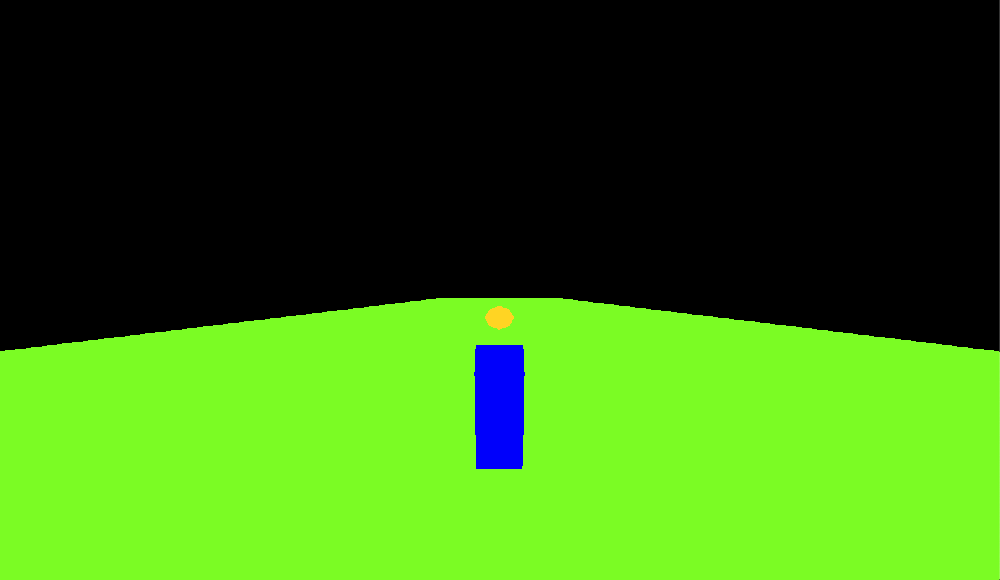
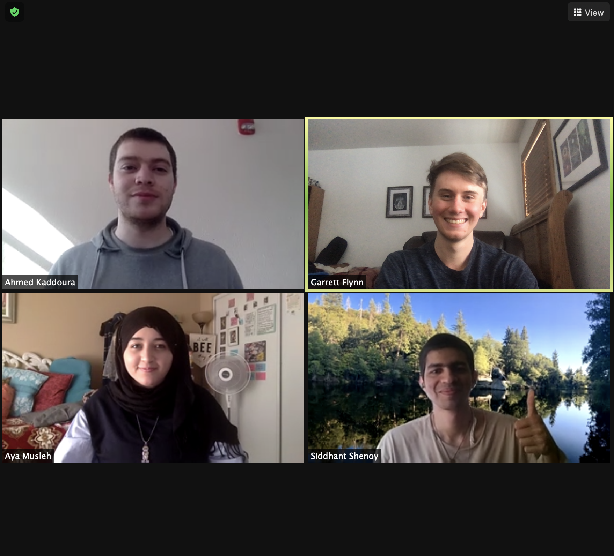

# BrainRunner
A 3D endless running game controlled by your brain 🤯

## The Story
BrainRunner was created by [Garrett Flynn](https://www.linkedin.com/in/garrettmflynn/) (USC), [Ahmed Kaddoura](https://www.linkedin.com/in/ahmed-kaddoura/) (USF), [Siddhant Shenoy](hhttps://www.linkedin.com/in/siddhant-shenoy-906114120/) (USC) and [Aya Musleh](https://www.linkedin.com/in/ayailiana/) (USC). **This game won the Device vertical at HackSC 2021**.

Get ready for more work from this team as they continue pushing forward the development of brainsatplay.js with innovative applications!

See the full story about BrainRunner on [our Devpost](https://devpost.com/software/brainrunner).

## The Team

